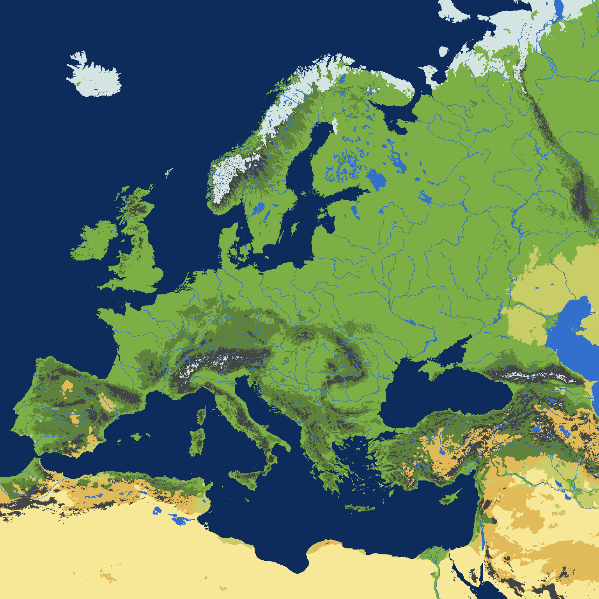
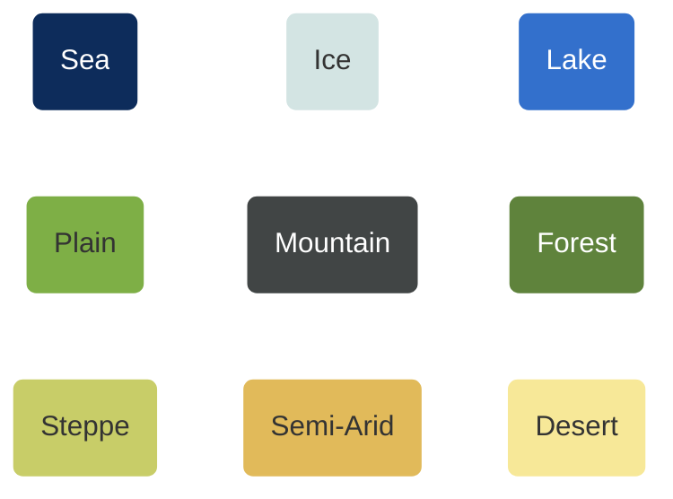

# Civilization
## Carte



$1 \textrm{px} \approx 3.3 \textrm{km}$ 
<br>
Plaine : Surface cultivable par pixel = 950 ha
<br>
Ere industrielle : 2 hab max par ha cultivable


| Terrain   |  Fertility  | Population Diffusivity 
| -------- | ------- | -------|
Sea | 0.0001 | 100
Ice | 0.0001 | 0.2
Lake | 0.0001 | 100
Plain | 1 | 1
Mountain | 0.0001| 0.2
Forest | 0.3 | 0.5
Steppe | 0.15 | 0.7
Semi-Arid | 0.1 | 0.7
Desert | 0.0001| 0.2

## Modèle

| Thème   |  Description  | Paramètres | Equation | Constantes
| -------- | ------- | -------| ---- |---- |
| Géographie  | La carte contient différents sous-espaces géographiques : plaines, montagnes, thalassographie. La carte est discrétisée sous forme de cases.   | | | $f :$ ``` fertility_per_technology_level ``` <br> $\kappa :$ ``` population_diffusivity ```
| Démographie  | Chaque case a une capacité démographique maximale, qui dépend du niveau technologique.     | $P :$ ``` population ```  <br> $T :$``` technological_level ```| $${dP \over dt} = r P(1-{P \over P_{max}}) +\textrm{div} (\kappa\nabla{P})$$ <br> $$P_{max} = f(T)$$ | $r :$ ``` natural_growth ```  |
| Culture    | Chaque unité de population a une “culture” qui évolue dans un espace de dimension 2. Elle est initialisée avec un bruit blanc aléatoire. La diffusion culturelle est est corrélée aux flux de population. On ajoute un terme de divergence pour forcer les cultures à se différencier. | $C :$  ``` culture ```  | $${dC \over dt}={\textrm{div} (\kappa P \nabla{C})\over P_{mean}} + {qC \over {q + \lVert C \rVert}} * ( 1- {\lVert C \rVert \over C_{max}} ) $$ | $q :$  ``` divergence_coefficient ```|


```mermaid
---
config:
    xyChart:
        width: 900
        height: 600
    themeVariables:
        xyChart:
            plotColorPalette: "#000000"
---
xychart-beta
    title " "
    x-axis [paleolithic, neolithic, copper_age, bronze_age, iron_age_1, iron_age_2, pre_industrial,industrial]
    y-axis "max_population_per_ha" 0 --> 2
    line [0.001, 0.01, 0.1, 0.2, 0.3, 0.5, 1,2]
```

