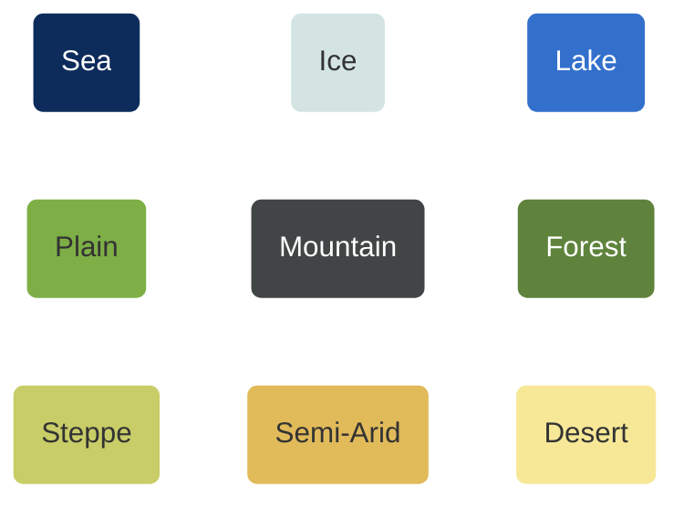

# Algorithme
## Carte


$1 \textrm{px} \approx 3.3 \textrm{km}$ 
<br>
Plaine : Surface cultivable par pixel = 950 ha
<br>
Ere industrielle : 2 hab max par ha cultivable


| Terrain   |  Fertility  | Population Diffusivity 
| -------- | ------- | -------|
Sea | 0.0001 | 100
Ice | 0.0001 | 0.2
Lake | 0.0001 | 100
Plain | 1 | 1
Mountain | 0.0001| 0.2
Forest | 0.3 | 0.5
Steppe | 0.15 | 0.7
Semi-Arid | 0.1 | 0.7
Desert | 0.0001| 0.2

## Modèle

| Thème   |  Description  | Paramètres | Equation | Constantes
| -------- | ------- | -------| ---- |---- |
| Géographie  | La carte contient différents sous-espaces géographiques : plaines, montagnes, thalassographie. La carte est discrétisée sous forme de cases.   | | | $f :$ ``` fertility_per_technology_level ``` <br> $\kappa :$ ``` population_diffusivity ```
| Démographie  | Chaque case a une capacité démographique maximale, qui dépend du niveau technologique.     | $P :$ ``` population ```  <br> $T :$``` technological_level ```| $${dP \over dt} = r P(1-{P \over P_{max}}) -\textrm{div} (\kappa\nabla{P})$$ <br> $$P_{max} = f(T)$$ | $r :$ ``` natural_growth ```  |
| Culture    | Chaque unité de population a une “culture” qui évolue dans un espace multidimensionnel. Cette culture accompagne les migrants vers les cases voisines. La diffusion culturelle est influencée par le “prestige culturel”, qui dépend du niveau technologique et de l’avancement politique.  | $C:$ ``` total_culture ```  <br> $c :$  ``` culture_vector ```  <br> $S:$  ``` political_stage ``` <br> $n :$  ``` number_of_cultures ``` | $$C = \sum^n c_k  $$ <br> $${dc_k \over dt}=({c_k \over C} \cdot T \cdot S)-{\textrm{div} (\kappa\nabla{(c_kP)})\over P}$$ | ``` cultural_prestige_tech_coefficient ```  <br>  ``` political_stage_coefficient ```|
| Progrès    | À chaque unité de temps, la probabilité qu’une case passe au niveau technologique ou politique suivant est calculée en fonction de la densité de population, de l’avancement politique et de la surface culturelle contiguë.   | ``` technology ```| $$\mathbb{P}(T+1 \mid T)=g(\int_x {S \cdot P \cdot \mathbb{1}_{\{c_k>0.5\}}})$$|``` tech_progress_population_coefficient ```  <br> ``` tech_progress_political_coefficient ```  <br>  ``` tech_progress_cultural_coefficient ```|
| Homogénéisation    | La culture se diffuse par proximité et forme nécessairement un zone culturelle connnexe. Des cultures minoritaires peuvent être présentes, une case est rattachée à la zone de sa culture majoritaire. Lorsqu'une culture minoritaire est recouverte intégralement par une seule culture majoritaire, elle est absorbée.  | | If $\forall x, c_k(x,t) > c_l(x,t)$, merge culture $l$ in culture $k$. |
| Migration    | La croissance démographique naturelle peut déborder sur les cases avoisinantes, selon un mécanisme de diffusion. Les populations sont attirées par les zones avec le meilleur prestige culturel   | |$$-\textrm{div} (\kappa\nabla{P})$$ |

$f :$ ``` fertility_per_technology_level ```
```mermaid
---
config:
    xyChart:
        width: 900
        height: 600
    themeVariables:
        xyChart:
            plotColorPalette: "#000000"
---
xychart-beta
    title " "
    x-axis [paleolithic, neolithic, copper_age, bronze_age, iron_age_1, iron_age_2, pre_industrial,industrial]
    y-axis "max_population_per_ha" 0 --> 2
    line [0.001, 0.01, 0.1, 0.2, 0.3, 0.5, 1,2]
```
